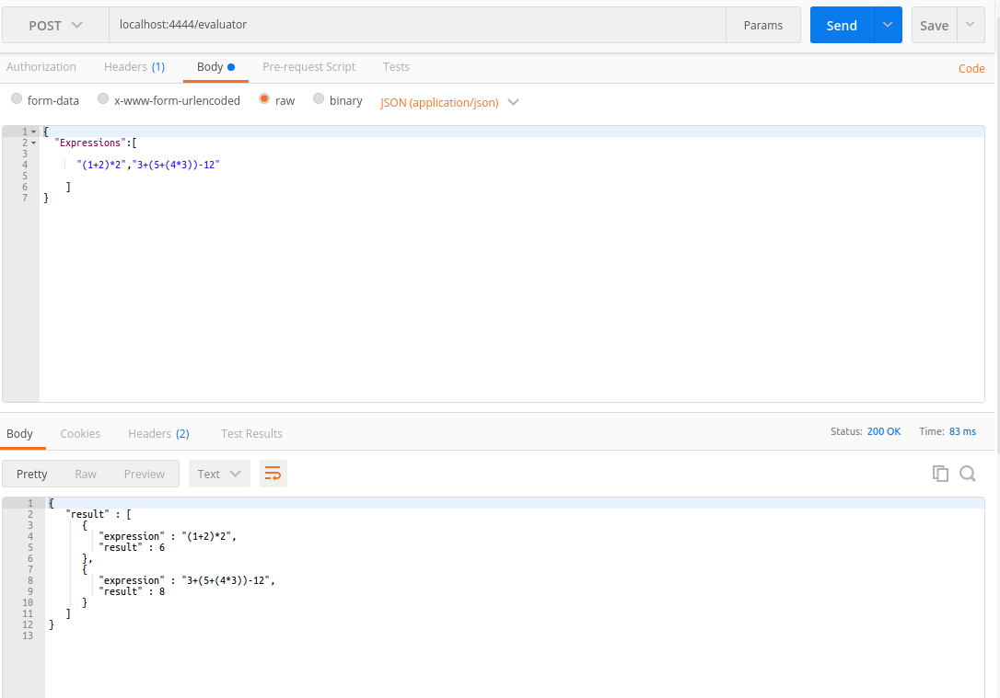

# C++ Coding Challenge

## description 
this application is used  to Evaluate an arithmetic expression form a string , the application provides you two targets :
* target 1 : a REST API that provides you the ability to passe a list of string in a POST request, and it will return to you a list of results .

  **[ send expressions ]**
  ----------------------
    Returns json data list of  result .

  *  URL :    http://localhost:http_port/evaluator

  * Method:   `POST`
  * Data Params
  ```json
  {
          "Expressions":[
                          "(1+2)*2",
                          "3+(5+(4*3))-12"
                  ]
  }
  ```

  * Success Response:

    * **Code:** 200 <br />
      **Content:** 
      ```json
      {"result" : [{"expression" : "(1+2)*2","result" : 6 },{ "expression" : "3+(5+(4*3))-12","result" : 8 }] }
      ```  
  * Error Response:

    * **Code:** 404 NOT FOUND <br />

  * Sample Call:

    ```
        curl -X POST \
        http://localhost:http_port/evaluator \
        -H 'Content-Type: application/json' \
        -H 'Postman-Token: 11475bc4-4532-484c-9a06-1ae929105d80' \
        -H 'cache-control: no-cache' \
        -d '{
              "Expressions":[

                              "(1+2)*2",
                              "3+(5+(4*3))-12"

                      ]
            }'
    ```
### to build the first target (REST API ) you will need  : 
```
sudo  apt-get  install  -y  libmicrohttpd-dev : GNU _libmicrohttpd_ is a small C library that is supposed to make it easy to run an HTTP server as part of another application
sudo  apt-get  install  -y  libjsoncpp-dev : A C++ library for interacting with JSON
```
* target 2 : a console exec , you will pass the expression in the console and the application will return to you the result in the console  


## Prerequisite Packages:
```
sudo  apt-get  install  cmake3 
sudo  apt-get  install  gcc-4.9
sudo  apt-get  install  g++-5
```
## usage :

### build the application :
```
mkdir build
cd build
```
* to build the first target :

```
cmake -D BUILD_API=true ..
make
```
* to build the second target :

```
cmake  ..
make
```
### run the application :
* run the firt target :
in this case the application will ask you enter the expression in console mode

```
./arithmetic-expression-evaluator

```
* run the second target :

```
./arithmetic-expression-evaluator [http_port]
```
the defaut value of  http_port is 4444

to interact with the application API  you can use CURL or POSTMAN , for CURL :
```
curl -X POST \
  http://localhost:http_port/evaluator \
  -H 'Content-Type: application/json' \
  -H 'Postman-Token: 11475bc4-4532-484c-9a06-1ae929105d80' \
  -H 'cache-control: no-cache' \
  -d '{
        "Expressions":[

                        "(1+2)*2",
                        "3+(5+(4*3))-12"

                ]
}'
```
for POSTMAN : 


the application will return as a responce this json data :

```@json
{
   "result" : [
      {
         "expression" : "(1+2)*2",
         "result" : 6
      },
      {
         "expression" : "3+(5+(4*3))-12",
         "result" : 8
      }
   ]
}

```